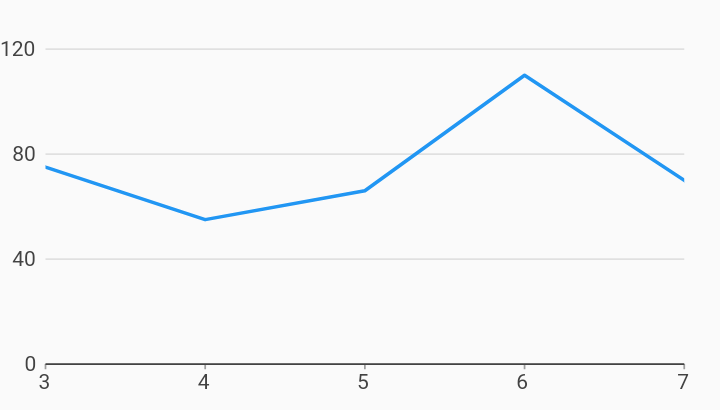

# Numeric Initial Viewport Axes Example



Example:

```
/// Example of setting an initial viewport for ordinal axis.
///
/// This allows for specifying the specific range of data to show that differs
/// from what was provided in the series list.
///
/// In this example, the series list has numeric data from 0 to 10, but we
/// want to show from 3 to 7.
/// We can do this by specifying an [NumericExtents] in [NumericAxisSpec].

import 'package:charts_flutter/flutter.dart' as charts;
import 'package:flutter/material.dart';

class NumericInitialViewport extends StatelessWidget {
  final List<charts.Series> seriesList;
  final bool animate;

  NumericInitialViewport(this.seriesList, {this.animate});

  /// Creates a [LineChart] with sample data and no transition.
  factory NumericInitialViewport.withSampleData() {
    return new NumericInitialViewport(
      _createSampleData(),
      // Disable animations for image tests.
      animate: false,
    );
  }


  @override
  Widget build(BuildContext context) {
    return new charts.LineChart(
      seriesList,
      animate: animate,
      domainAxis: new charts.NumericAxisSpec(
          // Set the initial viewport by providing a new AxisSpec with the
          // desired viewport, in NumericExtents.
          viewport: new charts.NumericExtents(3.0, 7.0)),
      // Optionally add a pan or pan and zoom behavior.
      // If pan/zoom is not added, the viewport specified remains the viewport.
      behaviors: [new charts.PanAndZoomBehavior()],
    );
  }

  /// Create one series with sample hard coded data.
  static List<charts.Series<LinearSales, int>> _createSampleData() {
    final data = [
      new LinearSales(0, 5),
      new LinearSales(1, 25),
      new LinearSales(2, 100),
      new LinearSales(3, 75),
      new LinearSales(4, 55),
      new LinearSales(5, 66),
      new LinearSales(6, 110),
      new LinearSales(7, 70),
      new LinearSales(8, 20),
      new LinearSales(9, 25),
      new LinearSales(10, 45),
    ];

    return [
      new charts.Series<LinearSales, int>(
        id: 'Sales',
        colorFn: (_, __) => charts.MaterialPalette.blue.shadeDefault,
        domainFn: (LinearSales sales, _) => sales.year,
        measureFn: (LinearSales sales, _) => sales.sales,
        data: data,
      )
    ];
  }
}

/// Sample linear data type.
class LinearSales {
  final int year;
  final int sales;

  LinearSales(this.year, this.sales);
}
```
