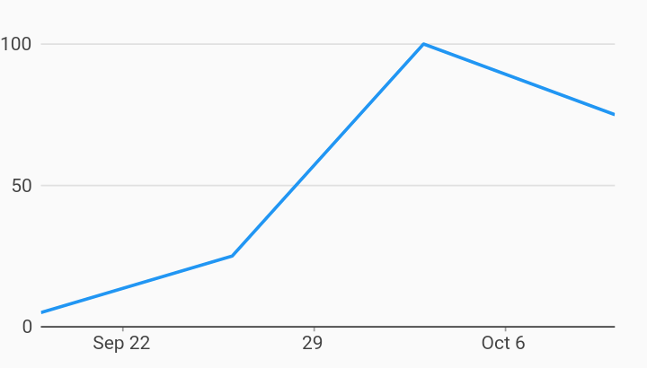

# Simple Time Series Charts Example



Example:

```
/// Timeseries chart example
import 'package:charts_flutter/flutter.dart' as charts;
import 'package:flutter/material.dart';

class SimpleTimeSeriesChart extends StatelessWidget {
  final List<charts.Series> seriesList;
  final bool animate;

  SimpleTimeSeriesChart(this.seriesList, {this.animate});

  /// Creates a [TimeSeriesChart] with sample data and no transition.
  factory SimpleTimeSeriesChart.withSampleData() {
    return new SimpleTimeSeriesChart(
      _createSampleData(),
      // Disable animations for image tests.
      animate: false,
    );
  }


  @override
  Widget build(BuildContext context) {
    return new charts.TimeSeriesChart(
      seriesList,
      animate: animate,
      // Optionally pass in a [DateTimeFactory] used by the chart. The factory
      // should create the same type of [DateTime] as the data provided. If none
      // specified, the default creates local date time.
      dateTimeFactory: const charts.LocalDateTimeFactory(),
    );
  }

  /// Create one series with sample hard coded data.
  static List<charts.Series<TimeSeriesSales, DateTime>> _createSampleData() {
    final data = [
      new TimeSeriesSales(new DateTime(2017, 9, 19), 5),
      new TimeSeriesSales(new DateTime(2017, 9, 26), 25),
      new TimeSeriesSales(new DateTime(2017, 10, 3), 100),
      new TimeSeriesSales(new DateTime(2017, 10, 10), 75),
    ];

    return [
      new charts.Series<TimeSeriesSales, DateTime>(
        id: 'Sales',
        colorFn: (_, __) => charts.MaterialPalette.blue.shadeDefault,
        domainFn: (TimeSeriesSales sales, _) => sales.time,
        measureFn: (TimeSeriesSales sales, _) => sales.sales,
        data: data,
      )
    ];
  }
}

/// Sample time series data type.
class TimeSeriesSales {
  final DateTime time;
  final int sales;

  TimeSeriesSales(this.time, this.sales);
}
```
